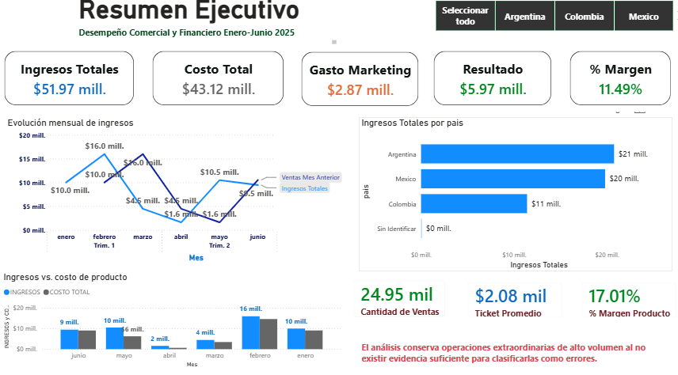
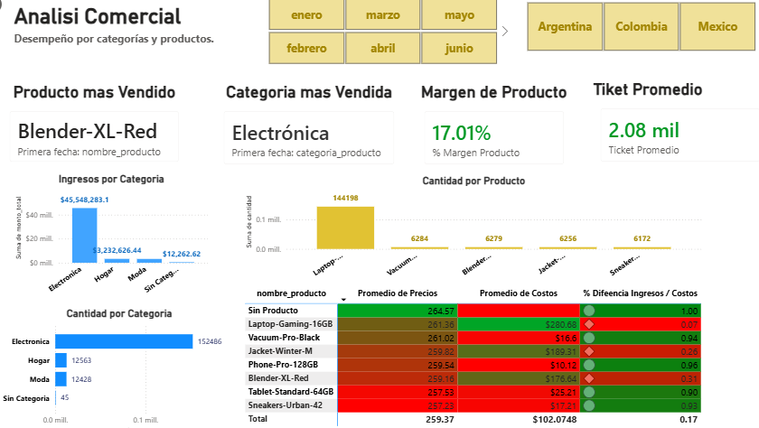
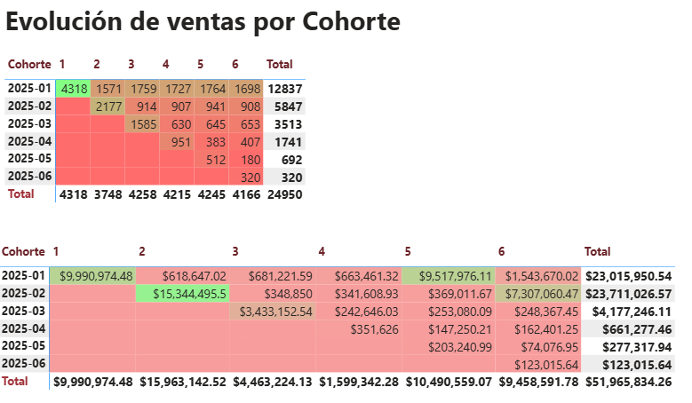

# RappiPlus | Análisis de negocio y comportamiento de usuarios

Proyecto de análisis de datos orientado a evaluar el desempeño comercial y financiero de RappiPlus, estudiar el comportamiento de los usuarios y comunicar resultados mediante Python, SQL, estadística y Power BI.

## Objetivo

Analizar ventas, costos, inversión en marketing y comportamiento de usuarios para identificar patrones relevantes y construir indicadores útiles para la toma de decisiones.

## Herramientas

- Python: Pandas, NumPy, Matplotlib, Seaborn y SciPy
- SQL / PostgreSQL
- Power BI y DAX
- Jupyter Notebook

## Preparación y calidad de datos

Durante la revisión del proyecto se establecieron criterios explícitos de calidad:

- Se excluyeron 50 registros con `cantidad = NaN` del análisis financiero.
- Se conservaron 4 cantidades negativas; podrían representar devoluciones o ajustes, aunque el dataset no permite confirmarlo.
- Se conservaron 10 operaciones extraordinarias de 10,000 y 20,000 unidades porque no existe evidencia suficiente para clasificarlas como errores.
- Las credenciales del entorno PostgreSQL original fueron eliminadas de la versión pública.

## KPIs financieros

| KPI | Resultado |
|---|---:|
| Ingresos totales | $51,965,834.26 |
| Costo de producto | $43,124,018.41 |
| Gasto de marketing | $2,871,843.53 |
| Resultado según costos incluidos | $5,969,972.32 |
| Margen | 11.49% |
| Registros analizados | 24,950 |

> El resultado corresponde a ingresos menos costo de producto e inversión en marketing. No representa utilidad neta contable.

## Dashboard Power BI

### Resumen Ejecutivo



### Análisis Comercial



### Evolución de ventas por cohorte



## Funnel de usuarios

El análisis histórico registró:

`7,796 first_visit → 7,582 select_item → 7,634 add_to_cart → 7,208 begin_checkout → 6,250 add_payment_info → 6,240 purchase`

Se detectaron 52 usuarios más en `add_to_cart` que en `select_item`. Por esta razón, estos valores se presentan como conteos agregados de usuarios únicos y no como un funnel secuencial validado.

La relación `purchase / first_visit` es aproximadamente 80.04%, pero no se interpreta como una conversión secuencial confirmada.

## Cohortes

El análisis original de cohortes se conserva como evidencia del trabajo SQL, pero durante la auditoría se identificaron limitaciones en la definición de cohorte, el denominador y las ventanas semanales. Por ello, sus porcentajes históricos no se utilizan como KPIs definitivos de retención.

En `sql/consultas_sql.sql` se conserva la consulta metodológica propuesta para una futura reconstrucción utilizando fecha de registro y usuarios únicos.

## Prueba A/B

| Variante | No convirtió | Convirtió | Total | Conversión |
|---|---:|---:|---:|---:|
| Control | 4,186 | 779 | 4,965 | 15.69% |
| Tratamiento | 4,215 | 820 | 5,035 | 16.29% |

Resultados:

- Chi-cuadrado: 0.6178
- p-value: 0.4319
- Cramér's V: 0.0079
- Nivel de significancia: α = 0.05

Aunque el tratamiento presentó una conversión descriptivamente superior, `p > 0.05`; por lo tanto, no existe evidencia estadísticamente significativa suficiente para atribuir la diferencia observada al tratamiento.

## Principales hallazgos

- El análisis financiero final trabaja con 24,950 registros después de excluir cantidades nulas.
- Las operaciones extraordinarias tienen un impacto importante sobre volumen e ingresos y fueron conservadas al no existir evidencia suficiente para clasificarlas como errores.
- El margen del modelo, después de costo de producto y marketing, es 11.49%.
- El funnel agregado presenta una inconsistencia de tracking entre `select_item` y `add_to_cart`.
- La prueba A/B no mostró una diferencia estadísticamente significativa entre control y tratamiento.

## Estructura del repositorio

```text
Proyecto_Final_RappiPlus/
├── README.md
├── data/
│   ├── orders.csv
│   ├── catalog.csv
│   └── marketing.csv
├── notebooks/
│   └── RappiPlus_Analisis.ipynb
├── dashboard/
│   └── RappiPlus_Dashboard.pbix
├── images/
│   ├── resumen_ejecutivo.png
│   ├── analisis_comercial.png
│   └── evolucion_ventas_cohorte.png
└── sql/
    └── consultas_sql.sql
```

## Limitaciones

Las tablas PostgreSQL `events`, `users` y `user_activity` pertenecían al entorno original del bootcamp y no se distribuyen en esta versión pública. Las consultas SQL se mantienen como evidencia metodológica, sin publicar credenciales ni afirmar reproducibilidad donde las fuentes originales ya no están disponibles.

## Autor

**Vidal**  
Portafolio de Análisis de Datos
